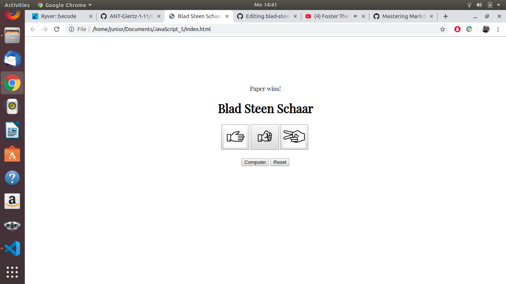

# Blad-steen-schaar
 https://merelvanpuymbroeck.github.io/blad-steen-schaar/.
 
### What?
Paper, Rock and Scissors game. When you press your chosen button you can play against the computer! Nice isn't it? I know,   *lame.*

### Why?
Cause or coach said we needed to complete this excercise to learn Javascript a bit more.
His encouragement words where: 
>"It's sunday and I shouldn't actually be working in the weekend so I'll write some encouragement later."
> --Filip --

### When?

I did this excerscise 17 june 2019.
 
### Who?

Hi, me , Merel Van Puymbroeck o/

### What did I use to get this?

- [x] if else statement
- [x] images
- [x] buttons

